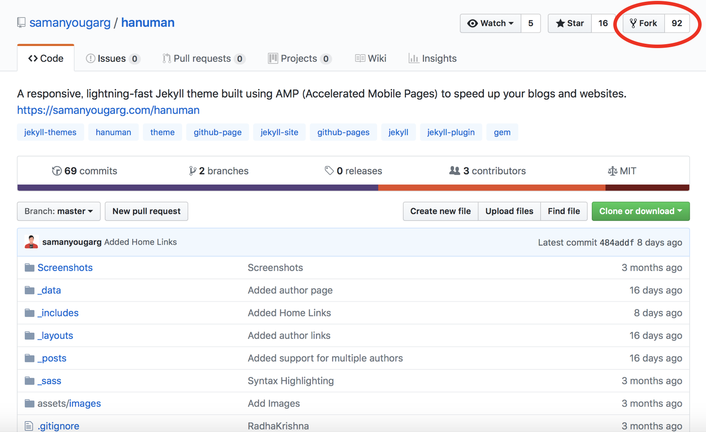
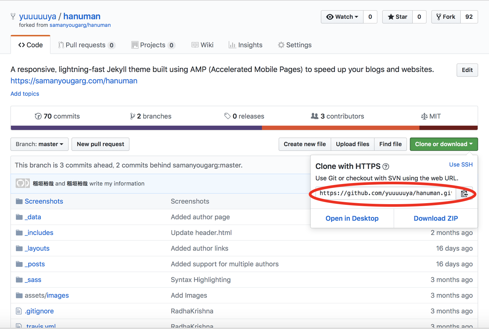

<h2>『環境構築』</h2>

<p>①Jekyllをインストール</p>
<p>Rubyから、インストールできので、このサイトを参考にJekyllをインストールしました。[『参考サトURL』](https://www.ruby-lang.org/ja/downloads/)</p>
<p>そして、terminalで</p>

```terminal
$ gem install jekyll
```

<p>で実行し、Jekyllをインストール！！</p>

<p>でも、FilePermissionErrorで、インストールできませんでした…
これは、「アクセス権がないよ」というエラー。そのため、先頭に”sudo”をつけて、実行し、パスワードを入れれば、インストールできました！！[『error参考URL』](https://teratail.com/questions/74708)</p>

```terminal
$ sudo gem install jekyll
```

<p>②GitHubでブログ公開用(Github-pages)のレポジトリを作成。
”username.github.io”で作ればOK！！
参考URLの”Create repository”を参照[『参考URL』](https://pages.github.com)</p>

<p>これで、環境設定は完了！！</p>


<h2>『ブログ構築』</h2>

<p>Jekyllは、たくさんのテンプレートがあるのが魅力！！！[『Jekyll-themes』](http://jekyllthemes.org)から好きなテーマを選ぶことができるので、僕は、[『Hanuman』](http://jekyllthemes.org/themes/hanuman/ )を選びました！！</p>
<p>こんな感じのテーマです。いいですよね〜。</p>


<p>まず、テーマをFork！！</p>


<p>Forkしたものを開き、cloneするためのURLを取得。</p>



<p>terminalでブログを作りたい住所まで行き、次のコードを実行すれば、clone完了です。</p>

```terminal
$ git clone clone　URL
```

<p>その後、次のコードを実行。</p>

```terminal
$ cd hanuman#クローンしてできたファイル
$ bundle install
```

<p>そして、”＿config.yml”に自分の情報を書き込む。
僕は、Atomを使っているので、Atomで開きました。</p>

```terminal
$ Atom _config.yml
```

<p>最後に、次のコードを実行して、terminalで表示された”serve addess”に飛ぶと自分が作成したブログ見れる！！！</p>
```terminal
$ bundle exec Jekyll serve
```

<p>あとは、GitHubに先ほど作った”username.github.io”のレポジトリに_site以外をcommit&push！！</p>
<p>※hanumanの場合は、cloneで作ったファイルと同じ住所に作られた”hanuman-pages”というファイルが_siteの代わりです。</p>
<p>この_siteは、生成された全サイトデータが保存されるフォルダです。この中のデータはJekyllでサイト構築するたびに作り直されるので、このフォルダの中のファイルを直接編集してはいけません。また、Github-pagesの裏で_site同じ処理してくれてるので、commit&pushする必要はありません。[『参考URL』](http://bn.dgcr.com/archives/20170117140100.html)</p>

<p>ただ、僕の場合は、簡単にcommit&pushさせてくれまんせんでした。</p>
<p>

```
$ git remote add origin https://github.com/username/username.github.io.git
```

を実行した時に、

```
fatal: remote origin already exists.
```

と表示され、commit&pushできませんでした…</p>
<p>その場合は、次のコードで、一度originを削除し、再度originを登録してください。[『参考URL』](http://pyoonn.hatenablog.com/entry/2014/10/29/191744)</p>
```terminal
$ git remote rm origin
$ git remote add origin https://github.com/username/username.github.io.git
$ git push -u origin master
```

<p>あとは、"username.github.io"のレポジトリから、[setting]→[Githab pages]のところに、ブログようの公開用のURLが書いてあるので、見てみてください！！ただし、反映に時間がかかりま す…</p>
